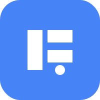

# 🚀 Jeviz - Intelligent Study Companion

**Your smart learning partner for BEPC and BAC exams in Ivory Coast**
_Combining spaced repetition, gamification, and AI-powered insights_

  

## 🌟 Features

- 🎯 **Exam-Focused Content**: Curated materials for BEPC and BAC exams
- 📱 **Mobile-First PWA**: Installable progressive web app with offline support
- 🧠 **Spaced Repetition System**: AI-optimized learning schedules
- 🎮 **Gamified Learning**: Earn badges, points, and compete on leaderboards
- 🤖 **AI Integration**: Smart content generation and progress predictions
- 📊 **Real-Time Analytics**: Detailed performance tracking
- 👥 **Social Learning**: Share decks and collaborate with peers

## 🛠 Technology Stack
